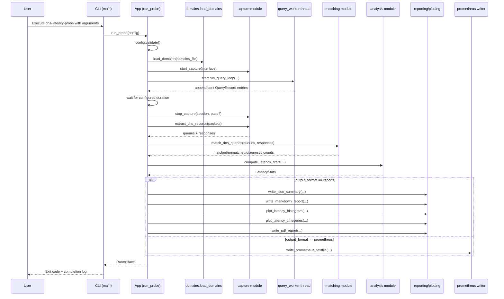

# DNS Latency Probe UML

This document summarizes the architecture of the `dns-latency-probe` application using Mermaid UML.

## 1) Module/Class Diagram

```mermaid
classDiagram
    class CLI {
      +build_parser() argparse.ArgumentParser
      +main(argv) int
    }

    class ProbeConfig {
      +interface: str
      +domains_file: Path
      +resolver: str
      +resolver_port: int
      +rate: float
      +duration: float
      +output_dir: Path
      +output_base_name: str
      +pcap_file: str
      +output_format: str
      +prometheus_dir: Path
      +log_level: str
      +validate() None
    }

    class App {
      +run_probe(config) RunArtifacts
      -_run_capture_phase(config, domains, pcap_path) tuple
      -_emit_reports(config, paths, stats, capture_queries, latencies, matched, run_date) None
      -_emit_prometheus_metrics(config, paths, stats, run_started_at) None
    }

    class Capture {
      +start_capture(interface) CaptureSession
      +stop_capture(session, pcap_path) list~Packet~
      +extract_dns_records(packets) tuple~QueryRecord,ResponseRecord~
    }

    class QueryWorker {
      +run_query_loop(domains, resolver, resolver_port, rate, stop_event, sent_queries, expected_queries) None
      +build_query_packet(...) Packet
      +resolve_source_ip(resolver) str?
    }

    class DomainLoader {
      +load_domains(domains_file) list~str~
    }

    class Matcher {
      +match_dns_queries(queries, responses) tuple
    }

    class Analysis {
      +compute_latency_stats(latencies, total_queries_sent, unmatched_queries, late_responses, duplicate_response_candidates, out_of_order_responses, stale_responses) LatencyStats
    }

    class Reporting {
      +write_json_summary(stats, invocation_options, output_path) None
      +write_markdown_report(stats, output_path, pcap_file, histogram_file, timeseries_file, pdf_file, sender_source_ip) None
      +write_pdf_report(markdown_path, histogram_path, timeseries_path, output_path) None
    }

    class Plotting {
      +plot_latency_histogram(latencies, output_path, resolver, duration_seconds, sender_source_ip, run_date) None
      +plot_latency_timeseries(matched_pairs, output_path, resolver, duration_seconds, sender_source_ip, run_date) None
    }

    class Prometheus {
      +write_prometheus_textfile(output_path, stats, resolver, resolver_port, output_base_name, run_started_unix) None
    }

    class QueryRecord {
      +sent_at: float
      +txid: int
      +qname: str
      +qtype: int
      +protocol: str
      +src_ip: str?
      +src_port: int
      +dst_ip: str
      +dst_port: int
    }

    class ResponseRecord {
      +seen_at: float
      +txid: int
      +qname: str
      +qtype: int
      +protocol: str
      +src_ip: str
      +src_port: int
      +dst_ip: str
      +dst_port: int
    }

    class MatchedPair {
      +query: QueryRecord
      +response: ResponseRecord
      +latency_seconds: float
    }

    class LatencyStats {
      +total_queries_sent: int
      +total_queries_observed: int
      +total_responses_observed: int
      +matched_pairs: int
      +unmatched_queries: int
      +response_rate: float?
      +loss_rate: float?
      +min_latency_seconds: float?
      +max_latency_seconds: float?
      +avg_latency_seconds: float?
      +median_latency_seconds: float?
      +p95_latency_seconds: float?
      +p99_latency_seconds: float?
      +late_responses: int
      +duplicate_response_candidates: int
      +out_of_order_responses: int
      +stale_responses: int
    }

    CLI --> ProbeConfig : builds
    CLI --> App : calls run_probe()

    App --> ProbeConfig : validates
    App --> DomainLoader : load_domains()
    App --> Capture : start/stop + extract records
    App --> QueryWorker : background DNS sender
    App --> Matcher : match_dns_queries()
    App --> Analysis : compute_latency_stats()

    App --> Reporting : reports mode
    App --> Plotting : reports mode
    App --> Prometheus : prometheus mode

    Capture --> QueryRecord : produces
    Capture --> ResponseRecord : produces
    Matcher --> MatchedPair : produces
    Analysis --> LatencyStats : produces
```

## 2) Main Runtime Sequence

```mermaid
sequenceDiagram
    participant U as User
    participant C as CLI (main)
    participant A as App (run_probe)
    participant D as domains.load_domains
    participant Cap as capture module
    participant W as query_worker thread
    participant M as matching module
    participant S as analysis module
    participant R as reporting/plotting
    participant P as prometheus writer

    U->>C: Execute dns-latency-probe with arguments
    C->>A: run_probe(config)
    A->>A: config.validate()
    A->>D: load_domains(domains_file)

    A->>Cap: start_capture(interface)
    A->>W: start run_query_loop(...)
    W-->>A: append sent QueryRecord entries

    A->>A: wait for configured duration
    A->>Cap: stop_capture(session, pcap?)
    A->>Cap: extract_dns_records(packets)
    Cap-->>A: queries + responses

    A->>M: match_dns_queries(queries, responses)
    M-->>A: matched/unmatched/diagnostic counts
    A->>S: compute_latency_stats(...)
    S-->>A: LatencyStats

    alt output_format == reports
      A->>R: write_json_summary(...)
      A->>R: write_markdown_report(...)
      A->>R: plot_latency_histogram(...)
      A->>R: plot_latency_timeseries(...)
      A->>R: write_pdf_report(...)
    else output_format == prometheus
      A->>P: write_prometheus_textfile(...)
    end

    A-->>C: RunArtifacts
    C-->>U: Exit code + completion log
```
